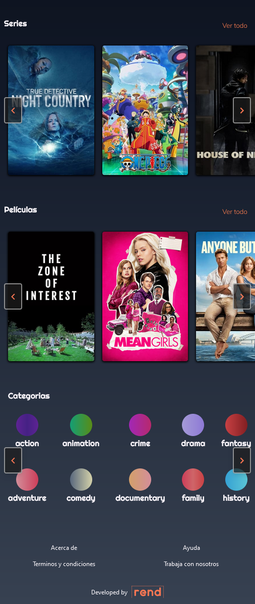
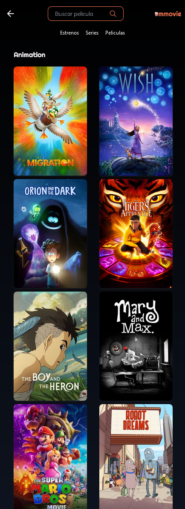

# mmovie
PROYECTO DE CONSUMO DE API REST CON JS DE PLATZI (ejemplos con APIs reales)

Demo
[mmovie](https://mickyrendon.github.io/mmovie/#home)

FEATURES
-Programación asincrona, funcional e imperativa
-API REST
-Consumo de TheMovieDB API con AXIOS
-Modularización
-Local Storage
-Location y hash navigation
-Manejo profesional del DOM
-DRY (refactorización del código)
-CSS con Tailwind
-Uso de Glide.js para los carruseles
-Mobile first, Responsive desing
-Diseño creado en Figma usando patrones de diseño UI [mmovie](https://www.figma.com/file/0qG6H72TugJszwciU6oKqT/mmovie?type=design&node-id=0%3A1&mode=design&t=5AfRXNkhxfjwWN1G-1)

TEMAS A TENER EN CUENTA

1.PAQUETES EXTERNOS: 
    El objetivo de este repositorio es que tenga facil visualización, es por eso que decidi usar el CDN de los paquetes que uso en este proyecto (GLide.js).
2.API KEY:
    Lo ideal en cualquier entorno profesional es que se maneje en el backend, pero para este caso meramente ilustrativo la comparto, asi no hay errores en el fetch.
3.TODO.txt
    Este archivo contiene los bugs que tiene este proyecto y que más adelante iré arreglando, también quedan muchas mejoras por hacer que las llevaré a cabo y en paralelo con el siguente curso de API REST con JS (performance y usabilidad), en donde aplicaré las siguientes mejoras:
        -Caché
        -almacenamiento
        -preloader (spinner, eskeleton)
        -Lazy loading
        -Optimización de imagenes
        -Infinite scroll
        -Paginación
        -Selección de idioma

SCREENSHOTS

MOBILE

#home 

menu #series 

searcher #query

#details

searcher #category

    

DESKTOP  

#home

